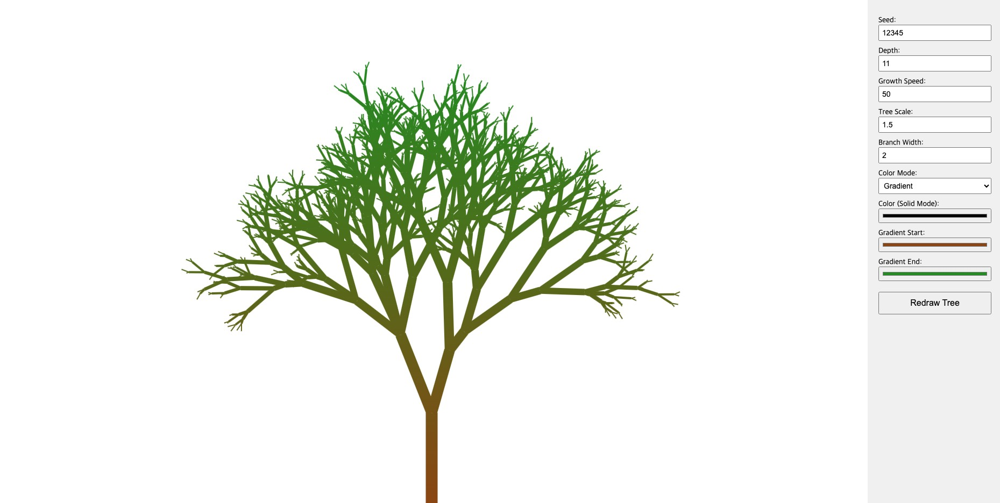

# JS Growing Tree

Feel free to customize and extend the Tree Plugin according to your project's needs!

---

The **Tree Plugin** is a JavaScript library that creates an animated tree on an HTML canvas. The tree is generated deterministically using a seed value, so that the same seed always produces the same tree structure regardless of changes to the display depth. The animation starts from the tree's roots and progresses upward.



## Files

- **tree.js**: Contains the TreePlugin code.
- **index.html**: A demo HTML file that shows how to use the TreePlugin with various configurable options via a control panel.

## Options

When creating a new instance of `TreePlugin`, you can pass an options object with the following properties:

- **container**:  
  *Type*: `HTMLElement`  
  *Description*: The HTML element where the tree will be rendered. Defaults to `document.body`.

- **depth**:  
  *Type*: `number`  
  *Description*: The number of tree levels (or visible depth) to be drawn. Note that the internal tree structure is generated using a fixed full depth to maintain determinism.

- **growthSpeed**:  
  *Type*: `number`  
  *Description*: The speed at which the branches animate.

- **treeScale**:  
  *Type*: `number`  
  *Description*: A scale factor for the overall size of the tree. The value is automatically limited based on the container height.

- **branchWidth**:  
  *Type*: `number`  
  *Description*: Determines the thickness of the tree branches.

- **colorMode**:  
  *Type*: `string` (`"gradient"` or `"solid"`)  
  *Description*: Sets the coloring mode.  
  - Use `"gradient"` to apply a linear gradient from `gradientStart` to `gradientEnd`.  
  - Use `"solid"` to apply a single color defined by `color`.

- **color**:  
  *Type*: `string` (CSS color value)  
  *Description*: The solid color used when `colorMode` is set to `"solid"`.

- **gradientStart**:  
  *Type*: `string` (CSS color value)  
  *Description*: The starting color of the gradient when using `"gradient"` mode.

- **gradientEnd**:  
  *Type*: `string` (CSS color value)  
  *Description*: The ending color of the gradient when using `"gradient"` mode.

- **seed**:  
  *Type*: `number` or `string`  
  *Description*: A numeric seed that initializes a custom random number generator. This ensures that the same tree structure is produced every time with the same seed.

## Installation and Setup

1. **Include the Plugin**  

Place the `tree.js` file in your project and include it in your HTML file:

```html
<script src="tree.js"></script>
```

2. **Prepare the HTML Container**

Create an element to serve as the container for the tree. For example:

```html
<div id="treeContainer"></div>
```

3. **Instantiate the Plugin**

Initialize the plugin by creating a new instance of TreePlugin and passing your desired options:

```html
<script>
  const container = document.getElementById('treeContainer');
  const tree = new TreePlugin({
    container: container,
    depth: 11,
    growthSpeed: 50,
    treeScale: 1,
    branchWidth: 1,
    colorMode: 'gradient',
    gradientStart: '#8B4513',
    gradientEnd: '#228B22',
    seed: 12345
  });
</script>
```

## Demo with Controls

An example demo is provided in the index.html file. This demo includes a control panel that allows you to adjust all the options in real time. When you change the settings and click the Redraw Tree button, the tree will be regenerated using the new parameters.

## How It Works

**Deterministic Generation:**

The tree structure is generated using a recursive algorithm with a fixed internal depth (fullDepth). A custom random number generator seeded by the provided seed ensures that the tree’s shape remains the same when using the same seed.

**Animated Drawing:**

The tree animation starts from the roots and draws upward, level by level. Each level of branches is fully animated before moving on to the next level.

**Customization:**

Adjust the provided options (depth, growth speed, scale, branch width, colors, etc.) to achieve various tree styles and animation speeds.

## License

TreePlugin is licensed under the [MIT License](LICENSE).
